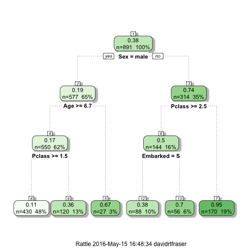

## Introduction & Titanic Prediction Idea
I've been completing tutorials related to the Kaggle machine learning from Disaster Competition
(see https://www.kaggle.com/c/titanic).  For this course I wanted to build an app. to help people better understand how the deaths caused by the sinking of the Titanic affected different passenger groups in different ways.  To do this I wanted to build an app that would have the user pretend that they were were aboard the ship.  I thought that by prompting them to input their age, sex, what class of ticket they would have purchased, and what their port of departure would have been, then this information could be used to return the probability that they would have survived based on data from the actual passengers.

--- .class #id 

## About the Titanic Dataset & Inputs
In R, through the "Titanic" package, data related to the survival of the passenger list is available.  However, the data is divided into two sets a training set and a testing set.  The training set consists of 891 observations and also includes a column which indicates whether or not an individual survived.  I used a subset of the training data (i.e., only the survived, age, sex, class, and embarked variables) to fit a regression tree and this tree is what I used in my app. to predict the probability of survival given the information that the individual inputs.

--- .class #id 

## The Fit Regression Tree

```
## [1]  62 830
```



--- .class #id 

## Implementing the Tree
To implement the tree that I've fit, I created a function that takes the age, sex, class, and embarked variables, and feeds them through a complex if else control structure that returns the appropriate probability.

--- .class #id 
